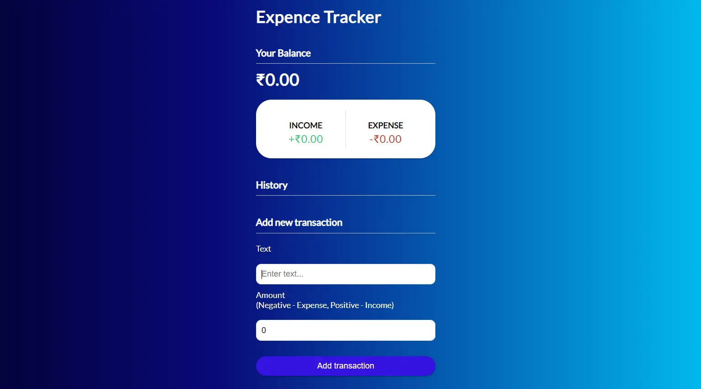
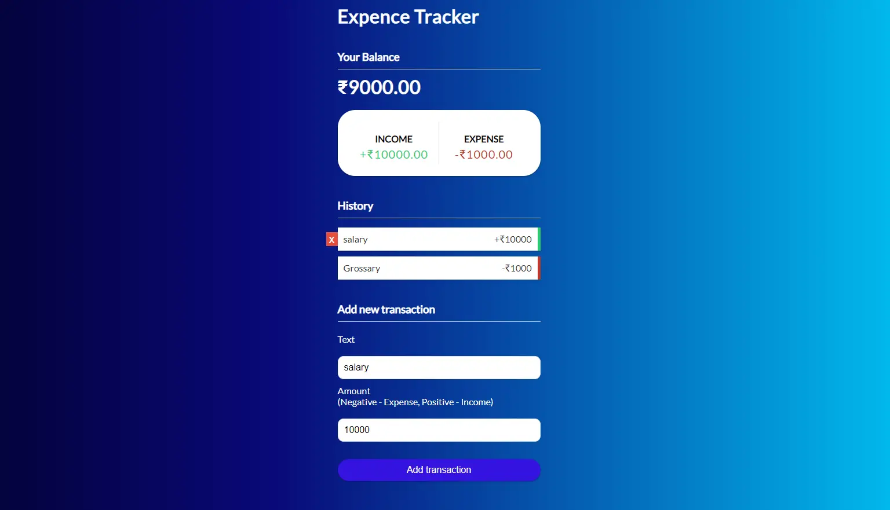

# Expense Tracker app using ReactJS

This is a simple expense tracker app where the user can add his daily expenses. 

All the expense information are stored in localstorage of the browser.

## Snapshot of the expense tracker app

1. Initial page

2. After adding some expenses

